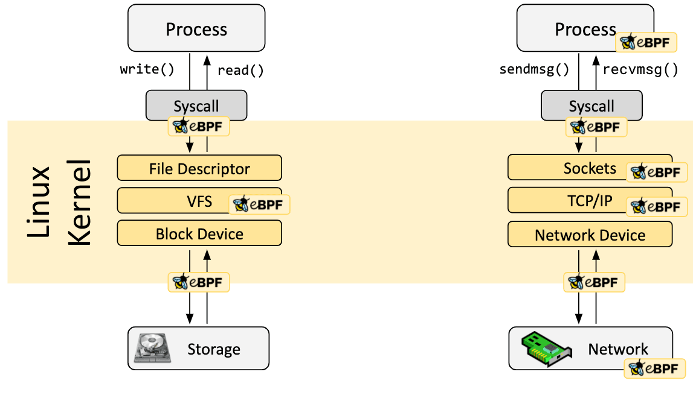

<!-- _class: title -->

# Dynamically programming the kernel using


---

<!-- _class: plan -->
<!-- _backgroundColor: orange -->
<!-- _color: white -->

# Plan

- Introduction
- Usage example with bcc
- Limitation

---

# Introduction - What is eBPF?

## Definition

eBPF est une technologie révolutionnaire issue du noyau Linux qui peut exécuter des programmes dans un environnement confiné, mais avec les privilèges du noyau du système d'exploitation. eBPF est utilisé pour étendre de façon sûre et efficace les capacités du noyau, sans qu'il soit nécessaire de modifier le code source du noyau ou de charger des modules.

---

# Introduction - What is eBPF?

## Naming

BPF signifiait à l'origine Berkeley Packet Filter, mais maintenant qu’eBPF (« extended BPF ») peut faire bien plus que filtrer des paquets, l'acronyme n'a plus de sens. eBPF est désormais considéré comme un terme autonome qui ne signifie plus vraiment quelque chose. Dans le code source de Linux, le terme BPF persiste, et dans les outils et la documentation, les termes BPF et eBPF sont généralement utilisés de manière interchangeable. Le BPF d'origine est parfois appelé cBPF (classic BPF) pour le distinguer d’eBPF.

 Le logo se nomme eBee. Il a été choisi lors du premier sommet d'eBPF

---


---

# Introduction - Why eBPF?

## Philosophie

Depuis toujours, le système d'exploitation est l’endroit idéal pour implémenter des solutions d'observabilité, de sécurité et de mise en réseau, en raison de la situation privilégiée du noyau pour superviser et contrôler l'ensemble du système. Évidemment, le noyau d’un système d'exploitation est difficile à faire évoluer en raison de son rôle central et de ses exigences élevées en matière de stabilité et de sécurité. L’innovation au cœur du système d’exploitation suit donc un rythme plus lent que celui des applications utilisateurs.

---

# Introduction - Why eBPF?

## Fonctionnement des applications

<!-- _class: image -->


---

# Introduction - Why eBPF?

## Concrètement

eBPF change complètement la donne. Cette technologie permet aux développeurs d’exécuter des programmes confinés dans le noyau, et ainsi d’ajouter de nouvelles fonctionnalités au système d’exploitation qui tourne sur une machine. Le système d'exploitation garantit alors la sûreté des programmes grâce à un vérificateur, et assure une vitesse d'exécution égale au code natif à l'aide d'un compilateur Just-In-Time (JIT). En conséquence, une vague de projets basés sur eBPF a vu le jour, couvrant un large éventail d’applications, notamment pour des fonctionnalités de réseau, d'observabilité et de sécurité nouvelle génération.

---

# Introduction - How it works?

## Les points d'attaches

Les programmes eBPF sont pilotés par des événements et sont exécutés lorsque le noyau ou une application passe un certain hook (point d’attache). Les hooks prédéfinis incluent les appels système, l'entrée/sortie de fonctions, les points de trace du noyau, les événements réseau, et d’autres encore.


---

# Introduction - How it works?

## L'évolutivité

Si un hook prédéfini n'existe pas pour un besoin particulier, il est possible de créer une sonde noyau (kprobe) ou une sonde utilisateur (uprobe) pour attacher des programmes eBPF presque n'importe où dans le noyau ou les applications utilisateur.

<!-- _class: image -->



---

# Introduction - Main Applications

- BCC
- Cilium
- Falco
- Pixie
- Tetragon


reference: [Official site - Applications](https://ebpf.io/fr-fr/applications/)

---

# Example using bcc

## Install bcc

<!-- _class: code -->

On ubuntu 24.04

```bash
sudo apt-get install bpfcc-tools linux-headers-$(uname -r)
```

---

# Example using bcc

## Principe

- Write a python script using the bcc library
- This python script will contain a C program to be loaded by the kernel
- Then the C program is attached to a probe that will execute the program
- At the end run the script

---

# Example using bcc

## Principe

- Write a python script using the bcc library

<!-- _class: code -->

```py
#!/usr/bin/python3

from bcc import BPF
```

---

# Example using bcc

## Principe

- Write a C program to be executed in the kernel

<!-- _class: code -->

```py
program = """
int hello_world(void *ctx) {
    bpf_trace_printk("Hello, World!\\n");
    return 0;
}
"""
```

---

# Example using bcc

## Principe

- Attach the C program to a probe that will execute it

<!-- _class: code -->

```py
b = BPF(text=program)
clone = b.get_syscall_fnname("clone")
b.attach_kprobe(event=clone, fn_name="hello_world")
b.trace_print()
```

---

# Example using bcc

## Helper functions

Helper functions are functions defined by the kernel which can be invoked from eBPF programs. These helper functions allow eBPF programs to interact with the kernel as if calling a function.

<!-- _class: code -->

```py
program = """
int hello_world(void *ctx) {
    u64 uid = bpf_get_current_uid_gid() & 0xFFFFFFFF;

    bpf_trace_printk("id: %d\\n", uid);
    return 0;
}
"""
```

---

# Example using bcc

## BPF hash maps

BPF ‘maps’ provide generic storage of different types for sharing data between kernel and user space. There are several storage types available, including hash, array. Several of the map types exist to support specific BPF helpers that perform actions based on the map contents. The maps are accessed from BPF programs via BPF helpers which are documented in the man-pages for bpf-helpers(7).

---

# Example using bcc

## Hash map example - Kernel Space

<!-- _class: code -->

```py
program_map = """
BPF_HASH(clones);

int hello_world(void *ctx) {
    u64 uid = bpf_get_current_uid_gid() & 0xFFFFFFFF;
    u64 counter = 0;
    u64 *p;

    p = clones.lookup(&uid);
    if (p != 0) {
        counter = *p;
    }

    counter++;
    clones.update(&uid, &counter);

    return 0;
}
"""
```

---

# Example using bcc

## Hash map example - User Space

<!-- _class: code -->

```py
b = BPF(text=program_map)
clone = b.get_syscall_fnname("clone")
b.attach_kprobe(event=clone, fn_name="hello_world")

while True:
    sleep(1)
    s = ""
    if b["clones"]:
        for k, v in b["clones"].items():
            s += f"ID: {k.value}, Clones: {v.value}\t"
        print(s)
    else:
        print("No clones found")
```

---

# Example using bcc

## Uprobe example - Kernel Space

<!-- _class: code -->

```py
bpf_text = """
#include <uapi/linux/ptrace.h>
int printret(struct pt_regs *ctx) {
    if (!ctx->ax)
        return 0;

    char str[80] = {};
    bpf_probe_read(&str, sizeof(str), (void *)ctx->ax);
    bpf_trace_printk("%s\\n", &str);

    return 0;
};
"""
```

---

# Example using bcc

## Uprobe example - User space

<!-- _class: code -->

```py
b = BPF(text=bpf_text)
b.attach_uretprobe(name="/bin/bash", sym="readline", fn_name="printret")

# header
print("%-9s %-6s %s" % ("TIME", "PID", "COMMAND"))

# format output
while 1:
    try:
        (task, pid, cpu, flags, ts, msg) = b.trace_fields()
    except ValueError:
        continue
    print("%-9s %-6d %s" % (strftime("%H:%M:%S"), pid, msg))
```

---

# Example using bcc

## Uprobe example - Finding ELF symbols

<!-- _class: code -->

You can read Elf symbols using:

```bash
$ objdump -T /bin/bash
```

to obtain:

```bash
ewae@ewae-jupiter:~/dev/presentation_ebpf/hello_world$ objdump -T /bin/bash | grep readline
00000000001612b8 g    DO .bss   0000000000000008  Base        rl_readline_state
00000000000df300 g    DF .text  000000000000038b  Base        readline_internal_char
00000000000dec00 g    DF .text  0000000000000260  Base        readline_internal_setup
000000000009e8d0 g    DF .text  00000000000000ed  Base        posix_readline_initialize
00000000000df690 g    DF .text  00000000000000c8  Base        readline
00000000001612c0 g    DO .bss   0000000000000004  Base        bash_readline_initialized
000000000015a180 g    DO .data  0000000000000008  Base        rl_readline_name
0000000000160748 g    DO .data  0000000000000004  Base        rl_readline_version
00000000000a6f10 g    DF .text  000000000000001d  Base        initialize_readline
0000000000161030 g    DO .bss   0000000000000004  Base        current_readline_line_index
0000000000160da0 g    DO .bss   0000000000000008  Base        current_readline_prompt
```

---

# BCC Tools

## Installation

BPF tools provides scripts help you to profile your system.

You can install those tools on Ubuntu 22.04 using:

``` 
sudo apt install libbpf-tools
```

and check the install:

``` 
sudo opensnoop-bpfcc
```

[BCC Official website](https://github.com/iovisor/bcc)

---

# BCC Tools

## Opensnoop example

<!-- _class: code -->

Opensnoop is used to trace open() syscalls.

```bash
ewae@ewae-jupiter:~/dev/presentation_ebpf$ sudo opensnoop --name cat
PID    COMM              FD ERR PATH
4832   cat                3   0 /etc/ld.so.cache
4832   cat                3   0 /lib/x86_64-linux-gnu/libc.so.6
4832   cat                3   0 /usr/lib/locale/locale-archive
4832   cat                3   0 ebpf_hello.py
```

---

# BCC Tools

## Strace equivalent

<!-- _class: code -->

Opensnoop is used to trace open() syscalls.

```bash
ewae@ewae-jupiter:~/dev/presentation_ebpf/hello_world$ strace cat ebpf_hello.py 
execve("/usr/bin/cat", ["cat", "ebpf_hello.py"], 0x7ffcecd40c58 /* 79 vars */) = 0
brk(NULL)                               = 0x60e76366f000
mmap(NULL, 8192, PROT_READ|PROT_WRITE, MAP_PRIVATE|MAP_ANONYMOUS, -1, 0) = 0x76ee14b89000
access("/etc/ld.so.preload", R_OK)      = -1 ENOENT (No such file or directory)
openat(AT_FDCWD, "/etc/ld.so.cache", O_RDONLY|O_CLOEXEC) = 3
fstat(3, {st_mode=S_IFREG|0644, st_size=87887, ...}) = 0
mmap(NULL, 87887, PROT_READ, MAP_PRIVATE, 3, 0) = 0x76ee14b73000
close(3)                                = 0
openat(AT_FDCWD, "/lib/x86_64-linux-gnu/libc.so.6", O_RDONLY|O_CLOEXEC) = 3
...
munmap(0x76ee14b73000, 87887)           = 0
getrandom("\x59\x28\x71\x32\xf0\xd6\x50\x2f", 8, GRND_NONBLOCK) = 8
brk(NULL)                               = 0x60e76366f000
brk(0x60e763690000)                     = 0x60e763690000
openat(AT_FDCWD, "/usr/lib/locale/locale-archive", O_RDONLY|O_CLOEXEC) = 3
fstat(3, {st_mode=S_IFREG|0644, st_size=5723792, ...}) = 0
mmap(NULL, 5723792, PROT_READ, MAP_PRIVATE, 3, 0) = 0x76ee14200000
close(3)                                = 0
fstat(1, {st_mode=S_IFCHR|0600, st_rdev=makedev(0x88, 0x2), ...}) = 0
openat(AT_FDCWD, "ebpf_hello.py", O_RDONLY) = 3
...
```

---

# BCC Tools

## Current toolkit

[BCC Official website](https://github.com/iovisor/bcc)

<!-- _class: image -->


